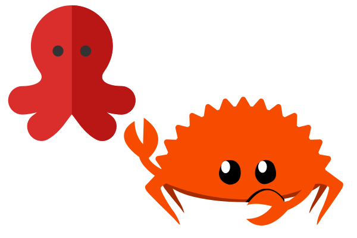

    

<h1 align="center">Rust Testing Libary</h1>

Rust port of [Testing Library](https://testing-library.com/).

[Testing Library](https://testing-library.com/) is a library of simple and complete testing utilities that encourage good testing practices.

## Frameworks

Rust Testing Library is available for these Rust frameworks:

-   [DOM](./packages/dom) ([`web-sys`](https://rustwasm.github.io/wasm-bindgen/web-sys/index.html))

The following frameworks are under consideration:

-   [Dioxus](https://dioxuslabs.com/)
-   [Leptos](https://leptos.dev/)
-   [Yew](https://yew.rs/)

See [the Rust Testing Library book](https://testing-library.rustforweb.org/introduction.html#frameworks) for more information.

## Documentation

See [the Rust Testing Library book](https://testing-library.rustforweb.org).

## Credits

The logo is a combination of [Ferris the Rustacean](https://rustacean.net/) and [an octopus icon](https://www.svgrepo.com/svg/164420/octopus).

## License

This project is available under the [MIT license](LICENSE.md).

## Rust for Web

The Rust Testing Library project is part of [Rust for Web](https://github.com/RustForWeb).

[Rust for Web](https://github.com/RustForWeb) creates and ports web UI libraries for Rust. All projects are free and open source.
